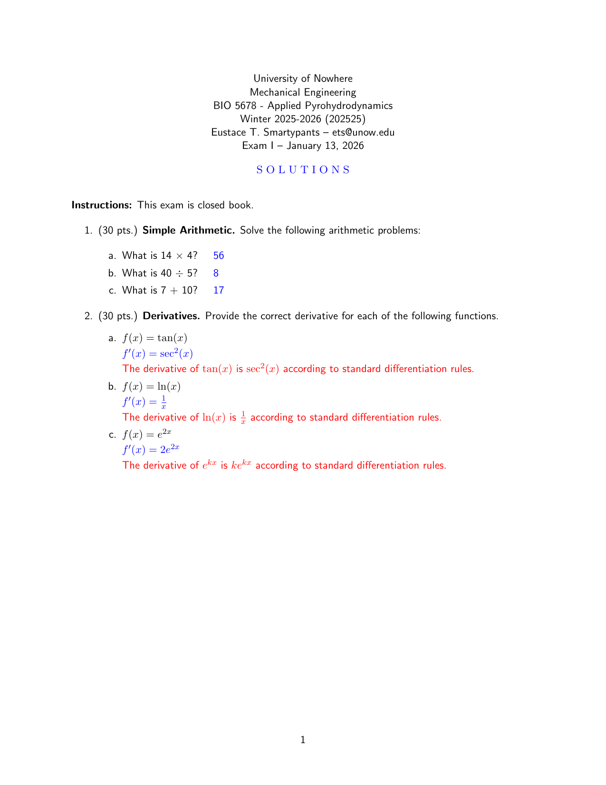
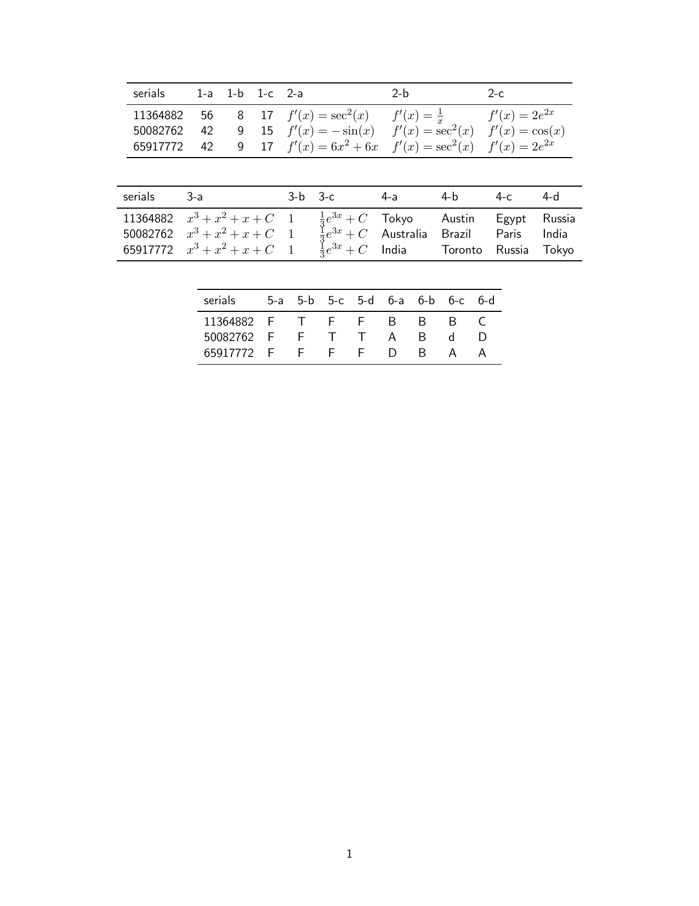

.. _examples_compound_exam:

Compound Exam
=============

This example demonstrates pygacity's primary strength: generating multiple,
individually unique exam versions from a single set of source files.  Numerical
questions are parameterized — each serial number gets a different set of values
drawn from a defined pick-list — and question pools (short-answer, fill-in-the-blank,
true/false, and multiple-choice) are randomly sampled and shuffled per serial.
All files are in the ``examples/compound_exam/`` directory.

.. code-block:: text

    compound_exam/
    ├── CompoundExam.yaml                  # pygacity configuration
    ├── compound_arithmetic.tex            # Problem 1: parameterized numerics
    ├── simple_integration.tex             # Problem 3: static with answer registration
    ├── derivatives_short_answer.yaml      # Problem 2: short-answer pool
    ├── geography_fill_in_the_blank.yaml   # Problem 4: fill-in-the-blank pool
    ├── true_false_questions.yaml          # Problem 5: true/false pool
    └── multiple_choice_questions.yaml     # Problem 6: multiple-choice pool

The Configuration File
----------------------

.. literalinclude:: ../../../examples/compound_exam/CompoundExam.yaml
    :language: yaml

Several features here go beyond the Simple Assignment example.

**build.seed and build.copies** — instead of one document, pygacity generates
``copies: 3`` independently seeded versions.  The ``seed`` value seeds the
random number generator used to derive each serial's unique seed, making the
set of exams fully reproducible.  Each version receives a unique serial number
embedded in the header and filename.

**pythontex blocks** — the first ``pythontex: [setup]`` block initializes
pygacity's pythontex session: it creates the ``Pick``, ``AnsSet``, and ``rng``
objects that parameterized source files use.  The matching
``pythontex: [teardown]`` block at the end persists the collected answers so
that the answer set document can be assembled afterwards.

**question blocks** — each block with a ``question_number`` key is a numbered
question rendered as an ``\item`` in the compiled document.  The ``points``
key sets the point value displayed next to each question.  The ``group``
integer determines how ``AnswerSet`` organises answers into tables; each
distinct group value gets its own table.  The optional ``config`` key points
to a YAML question-pool file used by ``short.tex``.

**short.tex reuse** — the same packaged ``short.tex`` template appears four
times, each time with a different ``config:`` YAML file specifying the question
pool, question type, count, and instructions for that section.

Parameterized Problem: compound_arithmetic.tex
----------------------------------------------

.. literalinclude:: ../../../examples/compound_exam/compound_arithmetic.tex
    :language: latex

This is the heart of pygacity's compound-exam capability.  ``Pick.pick_state``
draws one value for each named parameter from its ``pickfrom`` list (or uses
the ``default`` if no pick list is given).  The draws are seeded by the
serial number, so the same serial always produces the same values.  ``Pick.pick_state`` returns a ``Namespace`` whose
members are accessed via dot notation.

``AnsSet.register`` records each sub-part answer (labeled ``a``, ``b``, ``c``)
together with the problem index and group, so the answer set document can
tabulate all answers across all serials automatically.

The ``\py{...}`` commands embed the drawn values directly in the typeset
question text, so no manual editing of question numbers is ever needed.

Static Problem with Answer Registration: simple_integration.tex
---------------------------------------------------------------

.. literalinclude:: ../../../examples/compound_exam/simple_integration.tex
    :language: latex

Static problems — whose content does not vary between serials — still need to
register their answers so they appear in the answer set.  The ``AnsSet.register``
calls are guarded by ``if 'AnsSet' in locals()`` so the file also works in
contexts where no answer set is being built (e.g. the Simple Assignment example).

Question Pool Files
-------------------

Each ``short.tex`` section is driven by a YAML file that specifies the question
pool.  The ``count`` and ``shuffle: true`` config keys mean each serial draws a
random subset in a random order from the pool.

**derivatives_short_answer.yaml** — 8 derivatives, 3 drawn per serial:

.. literalinclude:: ../../../examples/compound_exam/derivatives_short_answer.yaml
    :language: yaml

**geography_fill_in_the_blank.yaml** — 11 fill-in-the-blank geography questions,
4 drawn per serial:

.. literalinclude:: ../../../examples/compound_exam/geography_fill_in_the_blank.yaml
    :language: yaml

**true_false_questions.yaml** — 8 true/false statements, 4 drawn per serial:

.. literalinclude:: ../../../examples/compound_exam/true_false_questions.yaml
    :language: yaml

**multiple_choice_questions.yaml** — 13 multiple-choice questions, 4 drawn per
serial with choices shuffled.  Two questions illustrate per-question shuffle
control: one uses ``shuffle_choices: false`` because a choice cross-references
others by label; another uses ``fixed_last: true`` to pin a ``None of the
above`` option while freely shuffling the remaining choices:

.. literalinclude:: ../../../examples/compound_exam/multiple_choice_questions.yaml
    :language: yaml

Building the Document
---------------------

From inside the ``compound_exam/`` directory, run:

.. code-block:: bash

    pygacity build CompoundExam.yaml

Pygacity generates one student PDF and one solutions PDF per serial, then
assembles a single answer set PDF covering all serials.

Output
------

The ``build/`` directory contains:

- ``ExamI-{serial}.pdf`` — student exam for each serial
- ``ExamI_soln-{serial}.pdf`` — instructor copy with solutions for each serial
- ``answerset.pdf`` — consolidated answer key for all serials and all groups
- ``buildfiles.zip`` / ``solnbuildfiles.zip`` — zipped LaTeX sources
- ``tex_artifacts.zip`` — intermediate LaTeX artifacts

**Two serials side by side** — the arithmetic problem values differ because each
serial's ``Pick.pick_state`` draws independently:

.. list-table::
   :widths: 50 50

   * - .. figure:: ../_static/examples/compound_exam_s1-1.png
          :width: 100%
          :alt: Exam page 1, serial 11364882

          ser. 11364882: 14x4, 40÷5, 7+10

     - .. figure:: ../_static/examples/compound_exam_s2-1.png
          :width: 100%
          :alt: Exam page 1, serial 50082762

          ser. 50082762: 14x3, 45÷5, 7+8

**Solutions for serial 11364882** (page 1):

**Answer set** — one table per group, one row per serial:

