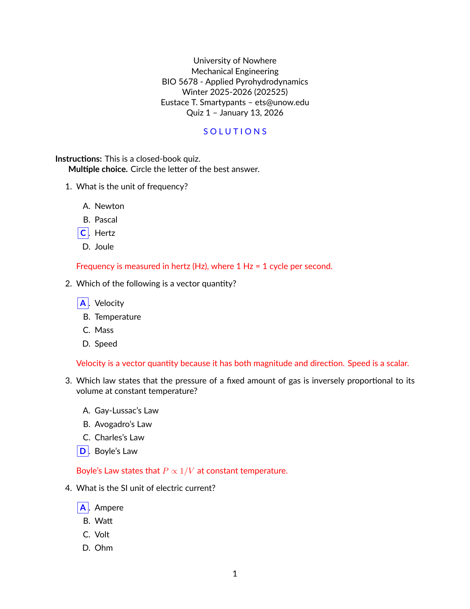

.. _examples_short_exam:

Short Exam
==========

This example shows how to build a single-level multiple-choice quiz using the
``short.tex`` template with ``toplevel: true``.  When ``toplevel`` is set, the
questions from the short-answer template become the document's top-level
enumerate items (numbered 1., 2., 3., …) rather than sub-items (a., b., c., …)
nested inside an outer question block.  All files for this example are in the
``examples/short_exam/`` directory.

The working directory contains a configuration file and a question bank:

.. code-block:: text

    short_exam/
    ├── ShortExam.yaml        # pygacity configuration
    └── science_mcq.yaml      # MCQ question bank (8 questions, 5 drawn per copy)

The Configuration File
----------------------

.. literalinclude:: ../../../examples/short_exam/ShortExam.yaml
    :language: yaml

The ``short.tex`` block has two key attributes:

- **config** points to the YAML question bank.
- **toplevel: true** signals that the items emitted by ``short.tex`` should
  form the document's top-level question list.  This suppresses the nested
  enumerate that would appear when ``short.tex`` is used as a sub-question
  inside a compound exam.

Without ``toplevel: true``, the same block used inside a compound exam would
produce an outer question number (1.) wrapping the inner sub-items (a., b.,
c., …).  With ``toplevel: true`` and no ``question_number``, the items are
rendered directly as 1., 2., 3., … at the document level.

The Question Bank
-----------------

.. literalinclude:: ../../../examples/short_exam/science_mcq.yaml
    :language: yaml

The ``config`` section draws 5 questions at random from the 8 in the bank and
shuffles the choice order for each question independently.  The ``content``
list supplies the full question pool; pygacity selects and shuffles at build
time using the per-copy random seed.

Building the Document
---------------------

From inside the ``short_exam/`` directory, run:

.. code-block:: bash

    pygacity build ShortExam.yaml

Output
------

After a successful build, the ``build/`` directory contains one student PDF
and one solutions PDF per copy (three copies in this example), plus zipped
build artifacts.

Because questions are drawn and shuffled independently for each copy, two
student PDFs will show different question sets and different choice orderings:

.. list-table::
   :widths: 50 50

   * - .. figure:: ../_static/examples/short_exam_s1-1.png
          :width: 100%
          :alt: Short exam, copy 1

          Copy 1

     - .. figure:: ../_static/examples/short_exam_s2-1.png
          :width: 100%
          :alt: Short exam, copy 2

          Copy 2

The solutions PDF for copy 1 shows the correct answer highlighted for each
question:

