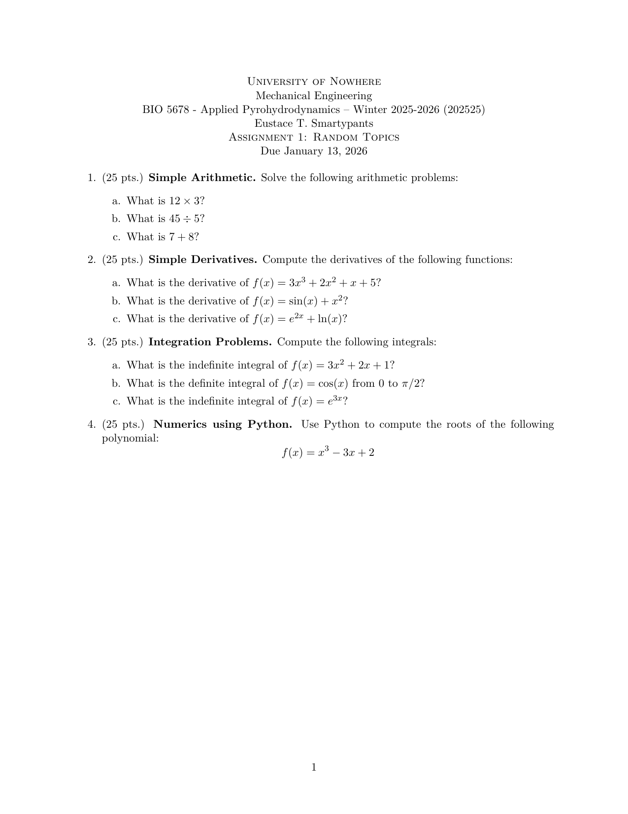

.. _examples_simple_assignment:

Simple Assignment
=================

This example shows how to build a simple four-problem assignment document using
``pygacity build``.  All files for this example are in the
``examples/simple_assignment/`` directory.

The working directory contains one configuration file and four LaTeX problem
source files:

.. code-block:: text

    simple_assignment/
    ├── SimpleAssignment.yaml       # pygacity configuration
    ├── simple_arithmetic.tex       # Problem 1
    ├── simple_derivatives.tex      # Problem 2
    ├── simple_integration.tex      # Problem 3
    └── python_numerics.tex         # Problem 4 (uses pythontex)

The Configuration File
----------------------

.. literalinclude:: ../../../examples/simple_assignment/SimpleAssignment.yaml
    :language: yaml

The configuration has two top-level sections.

**document.preamble** supplies extra LaTeX preamble content injected before
``\begin{document}``.  The ``commands`` sub-key sets autoprob class variables
(institution name, course, instructor, etc.) via ``\renewcommand``.  Setting
``font`` and ``pagestyle`` to ``~`` (null) suppresses the built-in defaults,
allowing the commands block to fully control preamble content.

**document.structure** defines the document body as an ordered list of blocks:

1. A ``text`` block that injects a ``\asnheader{...}{...}`` command directly
   into the document to produce the assignment title and due date.

2. Four question blocks, each identified by a ``question_number`` key.  Every
   question block has a ``source`` key pointing to its LaTeX fragment and a
   ``points`` key; the point value is displayed next to the question number in
   the compiled output.

**build** names the job (used as the base filename for output PDFs) and sets
the build directory where all generated files are written.

Problem Source Files
--------------------

Each problem is a standalone LaTeX fragment.  The ``\ifshowsolutions`` /
``\fi`` guards allow the same file to be used for both the student version and
the solutions PDF.

**simple_arithmetic.tex**

.. literalinclude:: ../../../examples/simple_assignment/simple_arithmetic.tex
    :language: latex

**simple_derivatives.tex**

.. literalinclude:: ../../../examples/simple_assignment/simple_derivatives.tex
    :language: latex

**simple_integration.tex**

.. literalinclude:: ../../../examples/simple_assignment/simple_integration.tex
    :language: latex

**python_numerics.tex**

This problem uses a ``pycode`` block to generate the polynomial expression
programmatically via pythontex.  The ``\py{...}`` commands embed computed
values directly in the typeset output.

.. literalinclude:: ../../../examples/simple_assignment/python_numerics.tex
    :language: latex

Building the Document
---------------------

From inside the ``simple_assignment/`` directory, run:

.. code-block:: bash

    pygacity build SimpleAssignment.yaml

Pygacity reads the configuration, assembles the LaTeX source, runs ``latexmk``
with XeLaTeX (and pythontex where needed), and writes the results to the ``build/``
directory specified in the configuration.

Output
------

After a successful build, the ``build/`` directory contains:

- ``Assignment.pdf`` — the student-facing document (solutions hidden)
- ``Assignment_soln.pdf`` — the instructor copy with solutions shown
- ``buildfiles.zip`` / ``solnbuildfiles.zip`` — zipped LaTeX sources for
  each version
- ``tex_artifacts.zip`` — intermediate LaTeX artifacts

Both PDFs are generated from the same set of source files; pygacity passes
the appropriate flag to the ``autoprob`` document class to control solution
visibility.

**Student version** (``Assignment.pdf``) — all four problems fit on a single page:

**Solutions version** (``Assignment_soln.pdf``) — the same document with
solutions revealed.  Problems 1–3 appear on page 1; the pythontex-generated
Problem 4 solution continues on page 2:

.. list-table::
   :widths: 50 50

   * - .. figure:: ../_static/examples/assignment_soln-1.png
          :width: 100%
          :alt: Solutions PDF, page 1

          Page 1

     - .. figure:: ../_static/examples/assignment_soln-2.png
          :width: 100%
          :alt: Solutions PDF, page 2

          Page 2
