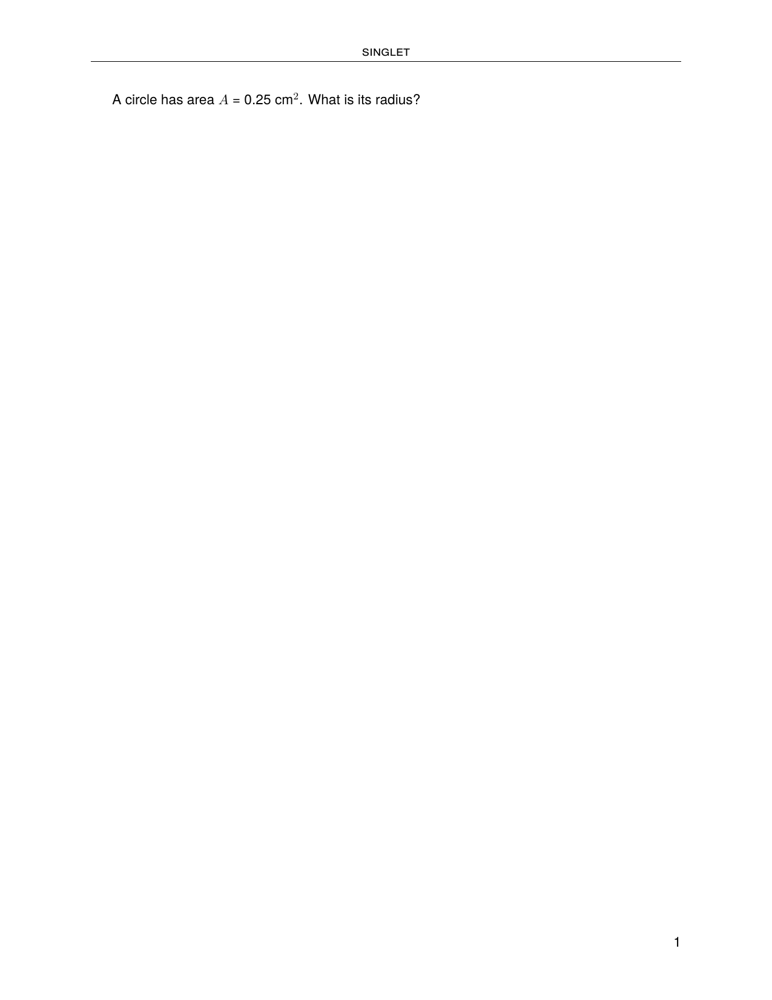
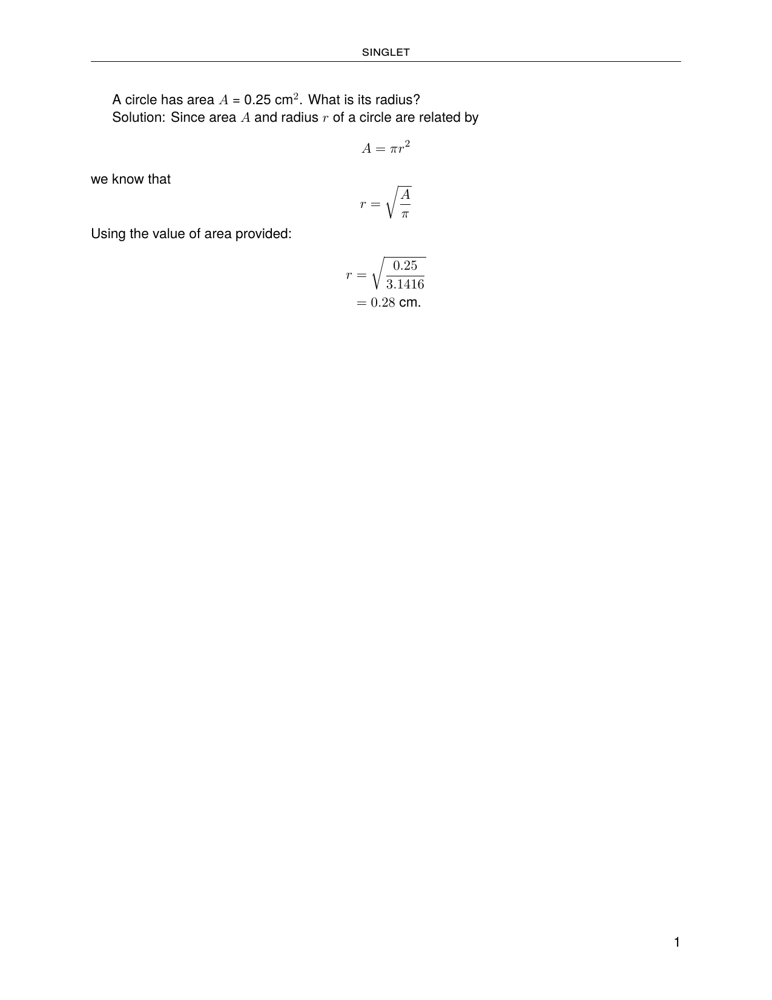

.. _examples_singlet:

Singlet Problem
===============

This example shows how to use ``pygacity singlet`` to build a quick
single-problem document for testing and previewing a LaTeX problem source
file.  All files for this example are in the ``examples/singlet/`` directory.

The working directory contains just one problem source file:

.. code-block:: text

    singlet/
    └── radius.tex       # a pythontex problem: area → radius

The Problem Source File
-----------------------

.. literalinclude:: ../../../examples/singlet/radius.tex
    :language: latex

This problem demonstrates the full pygacity workflow in miniature:

- A ``pycode`` block computes the radius from the given area using
  standard Python (``math.pi`` and ``math.sqrt``).
- ``AnsSet.register`` records the answer so it appears in the answer set
  document.
- ``\py{...}`` commands embed the computed values directly in the typeset
  problem statement and solution.
- The ``\ifshowsolutions`` / ``\fi`` guard keeps the solution hidden in
  the student copy and visible in the instructor copy.

Building the Document
---------------------

From inside the ``singlet/`` directory, run:

.. code-block:: bash

    pygacity singlet radius.tex

Pygacity assembles a minimal LaTeX document around the problem fragment,
runs ``latexmk`` with XeLaTeX (and pythontex, because the file contains a ``pycode`` block),
and writes all output to the ``build-singlet/`` directory.

Output
------

After a successful build, ``build-singlet/`` contains:

- ``radius-singlet.pdf`` — the student-facing document (solution hidden)
- ``radius-singlet_soln.pdf`` — the instructor copy with the solution shown
- ``buildfiles.zip`` / ``solnbuildfiles.zip`` — zipped LaTeX sources
- ``tex_artifacts.zip`` — intermediate LaTeX artifacts

**Student version** (``radius-singlet.pdf``):

**Solutions version** (``radius-singlet_soln.pdf``) — the solution is
revealed and the computed numeric values are typeset by pythontex:

