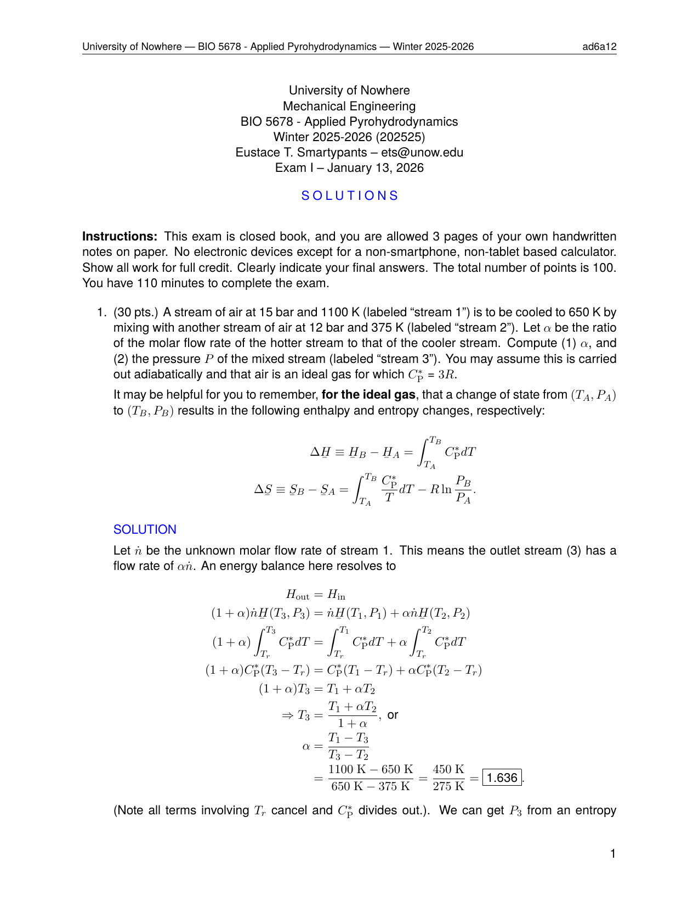
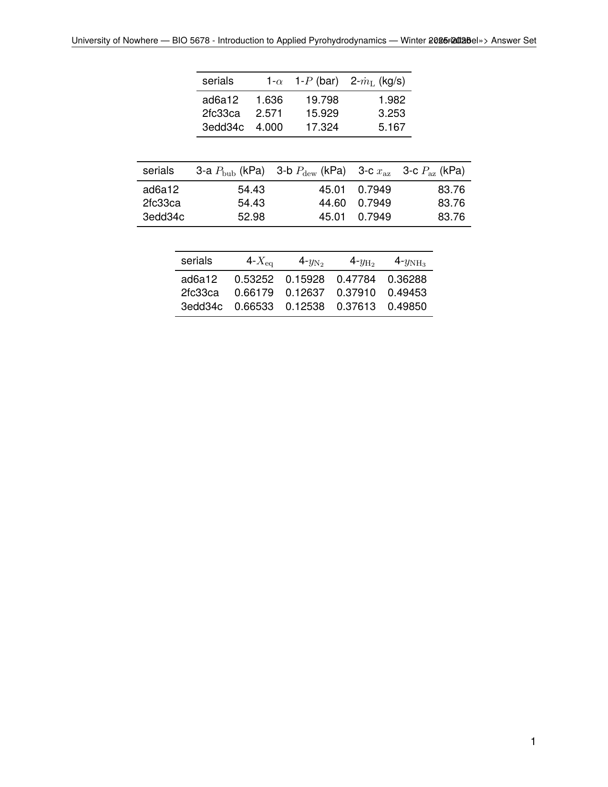

.. _examples_thermo_exam:

Thermo Exam
===========

This example is a full thermodynamics exam that showcases pygacity's integration
with the **sandler ecosystem** of Python packages (``sandlerprops``,
``sandlersteam``, ``sandlerchemeq``).  Compared to the Compound Exam example,
it introduces:

* Steam property look-ups via ``SANDLER(T=..., P=...)``
* pint-aware answer registration — ``AnsSet.register`` accepts
  :class:`pint.Quantity` values and stores the magnitude and unit string
  automatically
* Matplotlib figure generation inside a pythontex ``pycode`` block
* Chemical equilibrium calculations via ``ChemEqSystem``, with LaTeX output
  produced by the ``texgen_kacalculations``, ``stoichiometrictable_as_tex``, and
  ``thermochemicaltable_as_tex`` monkeypatches

All files are in the ``examples/thermo_exam/`` directory:

.. code-block:: text

    thermo_exam/
    ├── ThermoExam.yaml          # pygacity configuration
    ├── air_mixing.tex           # Problem 1: ideal-gas mixing (30 pts)
    ├── desuperheater.tex        # Problem 2: steam desuperheater (20 pts)
    ├── vle_binary_OCM.tex       # Problem 3: binary VLE + figure (20 pts)
    └── ammonia_synthesis.tex    # Problem 4: chemical equilibrium (30 pts)

The Configuration File
----------------------

.. literalinclude:: ../../../examples/thermo_exam/ThermoExam.yaml
    :language: yaml

A few points of interest:

**Three pythontex blocks** are listed at the top of the document structure:
``setup``, ``matplotlib``, and ``sandler``.  The ``sandler`` block imports
the full sandler ecosystem into the pythontex session — including
:class:`~sandlertools.SandlerSteamState` as ``SANDLER``,
:class:`~sandlerchemeq.Component`, :class:`~sandlerchemeq.Reaction`,
:class:`~sandlerchemeq.ChemEqSystem`, the ``sandlerprops`` compound database
as ``SandlerProps``, and all monkeypatches that add LaTeX-generation methods
to those classes.

**Header substitutions** — the ``header.tex`` preamble accepts course-specific
strings (university name, course number, instructor, date) via the top-level
``substitutions`` map, making it straightforward to reuse the same exam
template across courses.

Problem 1: Ideal-Gas Mixing (``air_mixing.tex``)
-------------------------------------------------

.. literalinclude:: ../../../examples/thermo_exam/air_mixing.tex
    :language: latex

This problem exercises the standard energy- and entropy-balance derivation for
adiabatic mixing of two ideal-gas streams.  Six parameters are picked
independently per serial: two inlet pressures, two inlet temperatures, the
target outlet temperature, and :math:`C^*_P/R` (drawn from ``[3.0, 3.5, 4.0]``).

``Pick.pick_state`` controls all six at once.  Note the mix of ``pickfrom``
(draws from an explicit list) and ``between`` (draws a random value in a
continuous range rounded to the specified precision) strategies.  The dictionary passed to
``Pick.pick_state`` also includes the ``units`` key, so the picked values are wrapped in pint units automatically (e.g. ``T1 = 300.0 * ureg.K``) and all subsequent arithmetic carries units through to the final answers.

The outlet pressure ``P3`` and flow-rate fraction :math:`\alpha` are computed as :class:`pint.Quantity` instances, which are passed to ``AnsSet.register``. The local Python variable ``qno`` always contains the current question number. The ``\pypp[#]{...}`` inline expressions are shorthand for ``pythontex``'s ``\py{...}`` that also detect :class:`pint.Quantity` values and format them with the magnitude and unit string together.  In the solution text, the same values are formatted with f-strings using use the ``~P`` pint format specifier (e.g. ``f'{P1:.0f~P}'``) so that value
and abbreviated unit string appear together in the typeset text automatically.  ``\pppl[#]{...}`` is the ``\pypp`` variant that also applies the ``~L`` format specifier, so it can be used directly in the LaTeX without needing an f-string.

Problem 2: Steam Desuperheater (``desuperheater.tex``)
------------------------------------------------------

.. literalinclude:: ../../../examples/thermo_exam/desuperheater.tex
    :language: latex

This problem uses the ``SANDLER`` steam-state function to look up specific
enthalpies at three thermodynamic states.  All five picked parameters carry
pint units from the start — inlet steam pressure and temperature (``P1``,
``T1``), saturation pressure (``Psat``), liquid feed temperature (``TL``),
and mass flow rate (``mdot``):

.. code-block:: python

    inlet  = SANDLER(T=T1, P=P1)     # superheated steam inlet
    outlet = SANDLER(P=Psat, x=1.0)  # saturated vapor outlet
    inL    = SANDLER(T=TL, x=0.0)    # saturated liquid feed

    mLdot = mdot * ((inlet.h - outlet.h) / (inlet.h - inL.h))
    AnsSet.register(idx, label=r'\(\dot{m}_\mathrm{L}\)', value=mLdot, ...)

``SANDLER`` accepts :class:`pint.Quantity` temperatures (including
``ureg.degC``) and pressures directly.  Each state object's ``.h`` attribute
is a :class:`pint.Quantity` (kJ/kg), so ``mLdot`` is automatically a
:class:`pint.Quantity` in kg/s.  Because ``AnsSet.register`` detects the
:class:`pint.Quantity` and extracts its magnitude and unit string, no manual
stripping is needed.  Note the use of ``\pypp`` and ``\pppl`` in the solution text to format the answers with units automatically.

Problem 3: Binary VLE with OCM Activity Coefficients (``vle_binary_OCM.tex``)
------------------------------------------------------------------------------

.. literalinclude:: ../../../examples/thermo_exam/vle_binary_OCM.tex
    :language: latex

This is the most feature-rich problem in the exam.  It combines:

* **Pint-aware state variables** — temperature and vapor pressures are
  :class:`pint.Quantity` objects (``T = 343.15 * ureg.K``,
  ``Pv = np.array([79.8, 40.5]) * ureg.kPa``), so all P-x-y arithmetic
  carries units automatically.
* **Bubble- and dew-point calculations** using the one-constant Margules (OCM)
  activity-coefficient model, with ``fsolve`` from SciPy for the dew-point.
* **Newton–Raphson iteration** — the NR loop explicitly stores intermediate
  values in Python lists and then packages them into a ``pd.DataFrame`` for
  inclusion in the solution as a LaTeX table.  All quantities going into
  the dataframe are plain floats; pint magnitudes are extracted with ``.m``
  *consistently* in both the loop initialization and the loop body.
* **Matplotlib figure** — a P-x-y diagram is generated inside the ``pycode``
  block using the standard ``fig, ax = plt.subplots(...)`` pattern and saved
  with ``plt.savefig(...)``; the filename is appended to ``pythontexFC`` so
  pygacity includes it in the build archive.  Note that ``ax.scatter`` requires
  a plain scalar for the y-coordinate, so ``Pazeo.m`` (not ``Pazeo``) is used
  when plotting the azeotrope marker.

Problem 4: Ammonia Synthesis Equilibrium (``ammonia_synthesis.tex``)
--------------------------------------------------------------------

.. literalinclude:: ../../../examples/thermo_exam/ammonia_synthesis.tex
    :language: latex

This problem demonstrates the deepest integration with the sandler ecosystem.
The equilibrium calculation itself is set up on a "mock" system at the picked
operating conditions, and the LaTeX for all intermediate steps is generated
by monkeypatched methods on :class:`~sandlerchemeq.ChemEqSystem`:

.. code-block:: python

    nitrogen = Component.from_compound(d.get_compound('nitrogen'),
                                       T=298.15 * ureg.K, P=1.0 * ureg.bar)
    hydrogen = Component.from_compound(d.get_compound('hydrogen (equilib)'),
                                       T=298.15 * ureg.K, P=1.0 * ureg.bar)
    ammonia  = Component.from_compound(d.get_compound('ammonia'),
                                       T=298.15 * ureg.K, P=1.0 * ureg.bar)

    rxn  = Reaction(components=[nitrogen, hydrogen, ammonia])
    mock = ChemEqSystem(components=components, N0=n0, T=T, P=P, reactions=[rxn])

    ka_calcslines       = mock.texgen_kacalculations(sig=5, simplified=True)
    thermochemicaltable = mock.thermochemicaltable_as_tex(sig=6)
    stotable            = mock.stoichiometrictable_as_tex(sig=3)
    mock.solve_implicit(Xinit=[0.5], simplified=True)

The operating temperature ``T`` and pressure ``P`` picked by ``Pick.pick_state``
are wrapped in pint units (``ureg.K``, ``ureg.bar``) before being passed to
``ChemEqSystem``, as are the reference-state conditions for
``Component.from_compound``.

``Reaction`` automatically balances the stoichiometry from the ordered
component list (reactants first, products last) using the null-space of the
element-count matrix.  ``texgen_kacalculations`` generates a multi-line
``align*`` block showing the simplified van't Hoff derivation of
:math:`K_a(T)` from :math:`K_a(T_0)` (``simplified=True`` here matches the
problem statement, which tells students to use the simplified van't Hoff
equation).  ``solve_implicit`` is called with the same flag so the numerical
answer shown in the solution is consistent with the derivation typeset above it.

Building the Document
---------------------

From inside the ``thermo_exam/`` directory, run:

.. code-block:: bash

    pygacity build ThermoExam.yaml

Pygacity generates three student PDFs, three solution PDFs (one per serial),
and one answer-set PDF covering all serials.

Output
------

The ``build/`` directory contains:

* ``ExamI-{serial}.pdf`` — student exam for each of the three serials
* ``ExamI_soln-{serial}.pdf`` — instructor copy with solutions for each serial
* ``answerset.pdf`` — consolidated answer key for all serials
* ``buildfiles.zip`` / ``solnbuildfiles.zip`` — zipped LaTeX sources
* ``tex_artifacts.zip`` — intermediate LaTeX artifacts

**Student exam (serial 00ad6a12)** — two pages, problems shown without solutions:

.. list-table::
   :widths: 50 50

   * - .. figure:: ../_static/examples/thermo_exam_s1-1.png
          :width: 100%
          :alt: Student exam page 1

          Page 1: problems 1-2 and start of problem 3

     - .. figure:: ../_static/examples/thermo_exam_s1-2.png
          :width: 100%
          :alt: Student exam page 2

          Page 2: problem 3 (cont.) and problem 4

**Two serials side by side** — the picked values differ between serials
(``serial-hex: true`` so they appear as ``00ad6a12`` and ``02fc33ca``):

.. list-table::
   :widths: 50 50

   * - .. figure:: ../_static/examples/thermo_exam_s1-2.png
          :width: 100%
          :alt: Serial ad6a12, page 2

          ser. 00ad6a12

     - .. figure:: ../_static/examples/thermo_exam_s2-2.png
          :width: 100%
          :alt: Serial 02fc33ca, page 2

          ser. 02fc33ca

**Solutions (serial 00ad6a12, page 1)** — full worked solutions with typeset
computed values, including the entropy-balance derivation of the mixing pressure:

**Solutions (pages 5 and 6)** — the VLE problem solution includes the Newton–Raphson
iteration table and the P-x-y diagram generated by matplotlib:

.. list-table::
   :widths: 50 50

   * - .. figure:: ../_static/examples/thermo_exam_s1_soln-5.png
          :width: 80%
          :align: center
          :alt: Solutions page 5 showing VLE NR table and figure

     - .. figure:: ../_static/examples/thermo_exam_s1_soln-6.png
          :width: 80%
          :align: center
          :alt: Solutions page 6 showing VLE NR table and figure

**Answer set** — one table per question across all three serials.  Problem 1
shows :math:`\alpha` and :math:`P_3`; problem 2 shows
:math:`\dot{m}_\mathrm{L}` (with unit string in the column header).
Problem 3 (VLE) shows bubble-point, dew-point, azeotrope composition, and
azeotrope pressure.  Problem 4 (chemical equilibrium) shows :math:`X_{\rm eq}`
and the three equilibrium mole fractions:

